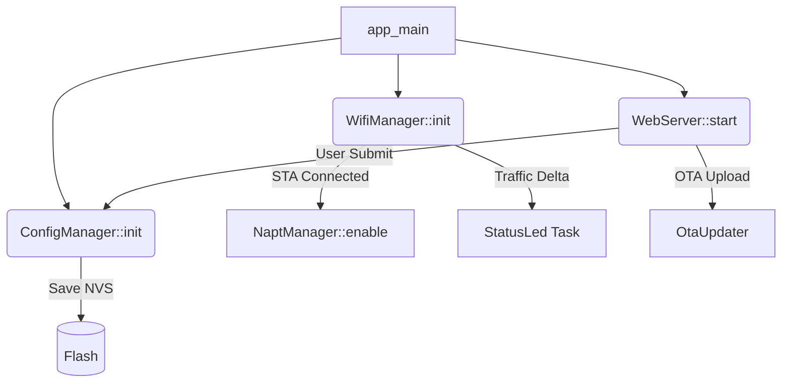

# 🏗 Project Architecture - WiFi Repeater

This document provides an in-depth look at the technical design and organizational patterns used in the ESP32-S3 WiFi Repeater project.

## 🏛 Design Philosophy

The project is built on **Senior-level C++ OOP** principles, focusing on:
- **Encapsulation:** Hardware peripherals and network logic are encapsulated in classes.
- **Resource Management:** Static allocation during initialization (`app_main`) ensures no runtime heap exhaustion (Rule #4).
- **Concurrency:** Heavy use of FreeRTOS tasks and thread-safe primitives (Queues, EventGroups).

---

## 🧩 Core Components

### 1. `WifiManager`
The central orchestration class. It manages two network interfaces simultaneously:
- **STA Interface:** Connects to the upstream internet source.
- **AP Interface:** Provides the local hotspot.
- **Event Handling:** Uses the ESP-IDF Event Loop to react to `IP_EVENT_STA_GOT_IP` and `WIFI_EVENT_STA_DISCONNECTED`.

### 2. `NaptManager`
A specialized manager for **Network Address Port Translation**.
- Enables NAPT on the AP interface once the STA interface gains an IP.
- Configures LwIP to allow packet forwarding between the two interfaces.

### 3. `ConfigManager` (Singleton)
Manages persistent settings using the **Non-Volatile Storage (NVS)**.
- Thread-safe access to SSID, passwords, and system flags.
- Caches strings and bools in RAM during initialization for high-speed access.

### 4. `ConnectionMonitor` (Watchdog)
A dedicated FreeRTOS task that monitors connection health.
- Implements **Exponential Backoff** for reconnection attempts.
- Signalled via `EventGroups` by the `WifiManager`.

### 5. `WebServer`
An asynchronous HTTP server providing the configuration portal.
- Serves an embedded **Glassmorphic UI**.
- Handles POST requests for credentials and binary blobs for **OTA updates**.

---

## 🔄 Data & Communication Flow

## 🛠 Hardware Mapping

- **GPIO 0:** BOOT Button. Polled by `WifiManager` for factory reset logic.
- **GPIO 48:** WS2812 Data Line. Controlled via the RMT peripheral in `StatusLed`.

## 🚦 Status Protocol

| Color | Pattern | Meaning |
| :--- | :--- | :--- |
| 🔵 **Blue** | Pulse | System Ready / Standby |
| 🟡 **Yellow** | Blinking | Scanning / Connecting |
| 🟢 **Green** | Breathing | Active Traffic Flow |
| 🔴 **Red** | Solid | Error / Factory Reset Triggered |
